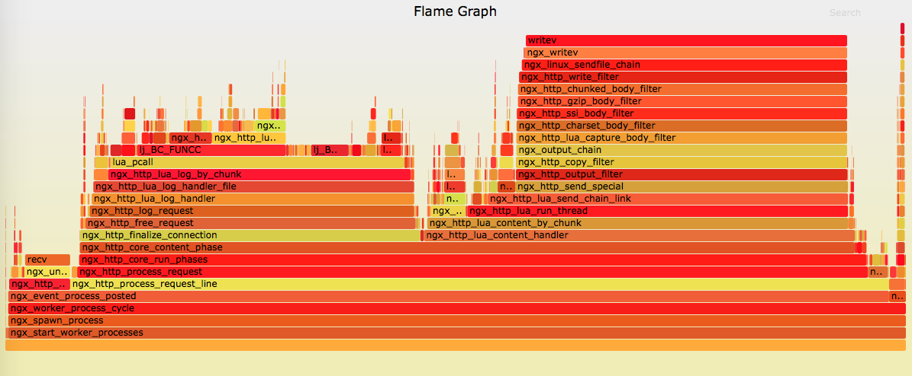
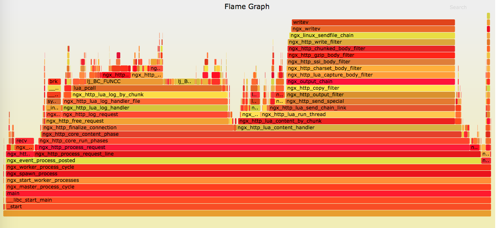

对于 `Mio` 这种对业务代码带有侵入性的项目，最大的担心就是性能问题。会带来多少的性能损耗，如何确定是否有性能问题，以及如何定位性能问题呢？

这里会介绍两个通用的方法，对于基于 `OpenResty` 的项目都是适用的。
特别的，火焰图这种动态跟踪的方法不仅对 OpenResty 有用，对其他进程都是非常有效的。

+ 火焰图
我们在 CentOS 7 上面对以下三种情况生成了对应的火焰图，从对比中可以看出 `Mio` 的 CPU 占用。

你需要保证安装了于 kernel 版本号 **完全一致** 的 kernel-debuginfo 和 kernel-devel 包，否则会出现各种诡异问题。
幸运的是，CentOS 7上面 systemtap 的环境一般都是直接可用的。

生成火焰图还需要安装两个工具集：
https://github.com/openresty/nginx-systemtap-toolkit 和 https://github.com/brendangregg/FlameGraph，
请自行安装。

另外需要注意的是，你需要调整系统的 ulimit、tcp 等参数以及 OpenResty 的 worker_processes 和 worker_connections，
来配合压力测试工具，让 OpenResty 的工作进程满载，以便火焰图能够发现问题。

我们是在一台 24 核的服务器上面做的测试，OpenResty 的配置为：
```
worker_processes  4;

error_log  logs/error.log  error;

events {
    worker_connections  10240;
}
```

使用 ab 进行压力测试，你需要保证 OpenResty 所有 worker 的 CPU 满载:
> ab -c 300 -n 1000000 -k 127.0.0.1/hello

详细的测试方式和性能测试结果，我们会在 [benchmark](benchmark.md) 里面说明。

1. 直接返回字符串,没有任何 `Mio` 的代码

NGINX 的配置段为：

```
#init_worker_by_lua_file gateway/on_worker_init.lua;
#init_by_lua_file gateway/on_init.lua;
#log_by_lua_file gateway/on_log.lua;

server {
    listen 80;
    access_log off;

    location / {
        content_by_lua_block {
            ngx.say([[hello! this is Mio.]])
        }
    }
}
```
可以看到所有注入到执行阶段的代码都被注释掉了。在 ab 开始压力测试后，我们来生成火焰图（假设 NGINX 的 worker 进程 pid 是 4555）：
> ./sample-bt -p 4555  -t 5 -u >a.bt

如果有报错，请看下 `a.bt` 是否生成并不会空，因为有些 error 级别的错误也是可以忽略的。

> /root/FlameGraph/stackcollapse-stap.pl a.bt > a.cbt

> /root/FlameGraph/flamegraph.pl a.cbt > a.svg

恭喜你，火焰图已经成功生成了，我们用浏览器[打开它](flame_graph/hello.svg), 应该类似这样子:


2. 在 1 的基础上，加上 Mio 的统计代码(master分支)

NGINX 的配置段为：

```
init_worker_by_lua_file gateway/on_worker_init.lua;
init_by_lua_file gateway/on_init.lua;
log_by_lua_file gateway/on_log.lua;

server {
    listen 80;
    access_log off;

    location / {
        content_by_lua_block {
            ngx.say([[hello! this is Mio.]])
        }
    }
}
```
这样子，在每个请求的 log 阶段，都会过一遍统计代码。我们来看下这次的[火焰图](flame_graph/master.svg), 应该类似这样子:


3. 在 1 的基础上，加上 Mio 的统计代码(develop分支)

NGINX 的配置段为：

```
init_worker_by_lua_file gateway/on_worker_init.lua;
init_by_lua_file gateway/on_init.lua;
log_by_lua_file gateway/on_log.lua;

server {
    listen 80;
    access_log off;

    location / {
        content_by_lua_block {
            ngx.say([[hello! this is Mio.]])
        }
    }
}
```
同样的，在每个请求的 log 阶段，都会过一遍统计代码。我们来看下这次的[火焰图](flame_graph/develop.svg), 应该类似这样子:
。

develop 分支和 master 相比，利用了 OpenResty 1.11.2.1 最新的一个功能，shdict:incr() 新增了一个 init 的参数，删除了不少臃肿代码。
所以在火焰图上面基本一样。

+ LuaJIT NYI
以下内容大都摘抄自春哥在邮件列表的答复。

LuaJIT 的运行时环境包括一个用手写汇编实现的 Lua 解释器和一个可以直接生成机器代码的 JIT 编译器。

一开始的时候，Lua 字节码总是被 LuaJIT 的解释器解释执行。
LuaJIT 的解释器会在执行字节码时同时记录一些运行时的统计信息，比如每个 Lua 函数调用入口的实际运行次数，
还有每个 Lua 循环的实际执行次数。
当这些次数超过某个预设的阈值时，便认为对应的 Lua 函数入口或者对应的 Lua 循环足够的“热”，这时便会触发 JIT 编译器开始工作。

LuaJIT 的 JIT 编译器的实现目前还不完整，有一些基本原语它还无法编译，
比如 pairs() 函数、unpack() 函数、string.match() 函数、基于 lua_CFunction 实现的 Lua C 模块、FNEW 字节码，等等。
所以当 JIT 编译器在当前代码路径上遇到了它不支持的操作，
便会立即终止当前的 trace 编译过程（这被称为 trace abort），而重新退回到解释器模式。

JIT 编译器不支持的原语被称为 NYI（Not Yet Implemented）原语。比较完整的 NYI 列表在这篇文档里面：

>http://wiki.luajit.org/NYI

我们如何才能知道具体是哪一行 Lua 代码上的哪一个 NYI 原语终止了 trace 编译呢？答案很简单。
就是使用 LuaJIT 安装自带的 jit.v 和 jit.dump 这两个 Lua 模块。这两个 Lua 模块会打印出 JIT 编译器工作的细节过程。

```
    local v = require "jit.v"
    v.on("/tmp/jit.log")
```

所以我们可以把这两行代码，加入到 Mio 项目的 `gataway/on_init.lua` 代码中。然后重启 OpenResty，再次运行 ab 的压力测试，
就可以在 `/tmp/jit.log` 中发现 jit 的跟踪日志。

jit.v 模块的输出里如果有类似下面这种带编号的 TRACE 行，则指示成功编译了的 trace 对象，例如

>   [TRACE   6 shdict.lua:126 return]

这个 trace 对象编号为 6，对应的 Lua 代码路径是从 shdict.lua 文件的第 126 行开始的。

下面这样的也是成功编译了的 trace:

>    [TRACE  16 (15/1) waf-core.lua:419 -> 15]

这个 trace 编号为 16，是从 waf-core.lua 文件的第 419 行开始的，同时它和编号为 15 的 trace 联接了起来。

 而下面这个例子则是被中断的 trace:

>    [TRACE --- waf-core.lua:455 -- NYI: FastFunc pairs at waf-core.lua:458]

上面这一行是说，这个 trace 是从 waf-core.lua 文件的第 455 行开始编译的，但当编译到 waf-core.lua
文件的第 458 行时，遇到了一个 NYI 原语编译不了，即 pairs() 这个内建函数，于是当前的 trace 编译过程被迫终止了。

类似的例子还有下面这些：

>    [TRACE --- exit.lua:27 -- NYI: FastFunc coroutine.yield at waf-core.lua:439]
>    [TRACE --- waf.lua:321 -- NYI: bytecode 51 at raven.lua:107]

上面第二行是因为操作码 51 的 LuaJIT 字节码也是 NYI 原语，编译不了。

那么我们如何知道 51 字节码究竟是啥呢？我们可以用 nginx-devel-utils 项目中的 ljbc.lua 脚本来取得 51 号字节码的名字：

>    $ /usr/local/openresty/luajit/bin/luajit-2.1.0-alpha ljbc.lua 51
    opcode 51:
    FNEW

我们看到原来是用来（动态）创建 Lua 函数的 FNEW 字节码。ljbc.lua 脚本的位置是

>    https://github.com/agentzh/nginx-devel-utils/blob/master/ljbc.lua

非常简单的一个脚本，就几行 Lua 代码。

这里需要提醒的是，不同版本的 LuaJIT 的字节码可能是不相同的，所以一定要使用和你 nginx 链接的同一个 LuaJIT 来运行这个
ljbc.lua 工具，否则有可能会得到错误的结果。

过滤出来可能需要优化的代码：
> $ cat /tmp/jit.log | grep NYI | grep -v lower > nyi.log
