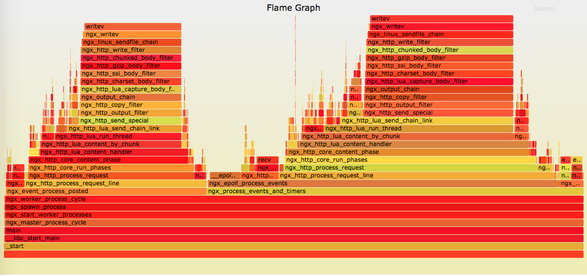

对于 `Mio` 这种对业务代码带有侵入性的项目，最大的担心就是性能问题。会带来多少的性能损耗，如何确定是否有性能问题，以及如何定位性能问题呢？

这里会介绍两个通用的方法，对于基于 `OpenResty` 的项目都是适用的。
特别的，火焰图这种动态跟踪的方法不仅对 OpenResty 有用，对其他进程都是非常有效的。

+ 火焰图
我们在 CentOS 7 上面对以下三种情况生成了对应的火焰图，从对比中可以看出 `Mio` 的 CPU 占用。

你需要保证安装了于 kernel 版本号 **完全一致** 的 kernel-debuginfo 和 kernel-devel 包，否则会出现各种诡异问题。
幸运的是，CentOS 7上面 systemtap 的环境一般都是直接可用的。

生成火焰图还需要安装两个工具集：
https://github.com/openresty/nginx-systemtap-toolkit 和 https://github.com/brendangregg/FlameGraph，
请自行安装。

另外需要注意的是，你需要调整系统的 ulimit、tcp 等参数以及 OpenResty 的 worker_processes 和 worker_connections，
来配合压力测试工具，让 OpenResty 的工作进程满载，以便火焰图能够发现问题。

我们是在一台 24 核的服务器上面做的测试，OpenResty 的配置为：
```
worker_processes  4;

error_log  logs/error.log  error;

events {
    worker_connections  10240;
}
```

使用 ab 进行压力测试，你需要保证 OpenResty 所有 worker 的 CPU 满载:
> ab -c 300 -n 1000000 -k 127.0.0.1/hello

详细的测试方式和性能测试结果，我们会在 [benchmark](benchmark.md) 里面说明。

1. 直接返回字符串,没有任何 `Mio` 的代码

NGINX 的配置段为：

```
#init_worker_by_lua_file gateway/on_worker_init.lua;
#init_by_lua_file gateway/on_init.lua;
#log_by_lua_file gateway/on_log.lua;

server {
    listen 80;
    access_log off;

    location / {
        content_by_lua_block {
            ngx.say([[hello! this is Mio.]])
        }
    }
}
```
可以看到所有注入到执行阶段的代码都被注释掉了。在 ab 开始压力测试后，我们来生成火焰图（假设 NGINX 的 worker 进程 pid 是 4555）：
> ./sample-bt -p 4555  -t 5 -u >a.bt

如果有报错，请看下 `a.bt` 是否生成并不会空，因为有些 error 级别的错误也是可以忽略的。

> /root/FlameGraph/stackcollapse-stap.pl a.bt > a.cbt

> /root/FlameGraph/flamegraph.pl a.cbt > a.svg

恭喜你，火焰图已经成功生成了，我们用浏览器[打开它](flame_graph/hello.svg), 应该类似这样子:

